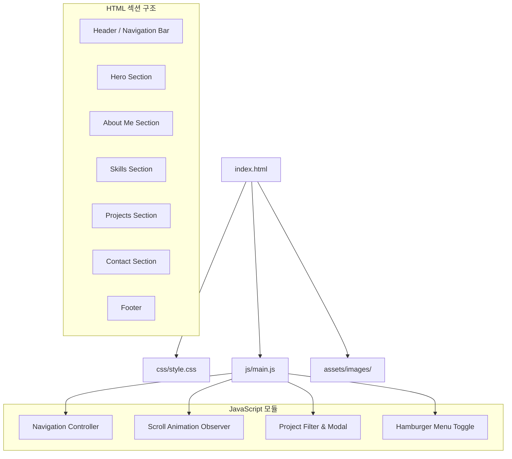
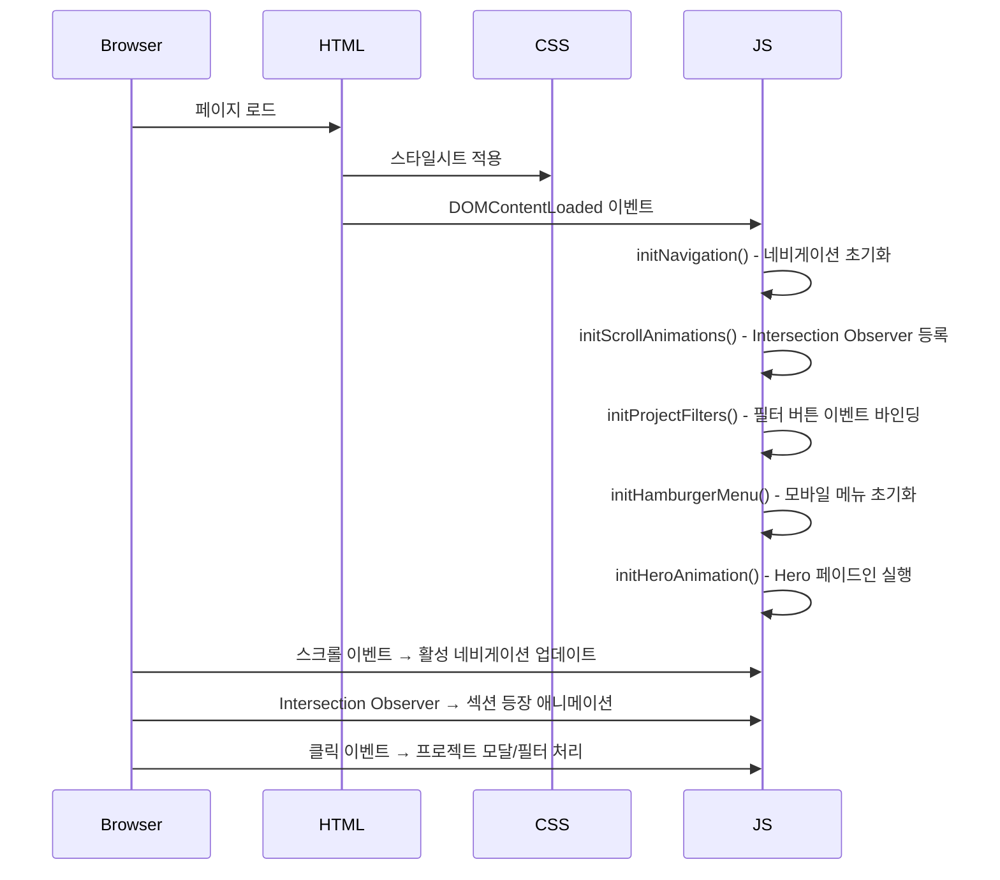

# 설계 문서: Web Portfolio

## 개요

서비스 기획/PM 직무 지원자를 위한 원페이지 정적 포트폴리오 웹사이트를 설계한다. HTML, CSS, Vanilla JavaScript만을 사용하며, 외부 프레임워크나 라이브러리 없이 구현한다. 반응형 디자인, 스크롤 애니메이션, 접근성(WCAG 2.1 AA)을 핵심 설계 원칙으로 삼는다.

### 기술 스택

- HTML5 (시맨틱 태그)
- CSS3 (커스텀 속성, Flexbox, Grid, 미디어 쿼리, 트랜지션/애니메이션)
- Vanilla JavaScript (ES6+, Intersection Observer API, DOM 조작)

### 파일 구조

```
/
├── index.html          # 메인 HTML (단일 페이지)
├── css/
│   └── style.css       # 전체 스타일시트
├── js/
│   └── main.js         # 전체 JavaScript
└── assets/
    └── images/         # 프로필 이미지, 프로젝트 썸네일 등
```

## 아키텍처

### 전체 구조

원페이지 정적 사이트로, 서버 사이드 로직 없이 클라이언트에서 모든 동작을 처리한다.



### 렌더링 흐름



### 반응형 브레이크포인트 전략

| 구간 | 너비 범위 | 레이아웃 특성 |
|------|-----------|---------------|
| 모바일 | ~767px | 단일 열, 햄버거 메뉴, 카드 1열 |
| 태블릿 | 768px~1023px | 2열 그리드, 축소된 네비게이션 |
| 데스크톱 | 1024px~ | 다열 그리드, 전체 네비게이션 |

## 컴포넌트 및 인터페이스

### 1. Navigation Controller

네비게이션 바의 모든 동작을 관리한다.

**책임:**
- 고정(fixed) 네비게이션 바 렌더링
- 스무스 스크롤 처리 (`scroll-behavior: smooth` + JS 폴백)
- 현재 섹션 활성 표시 (스크롤 위치 기반)
- 햄버거 메뉴 토글 (모바일)

**인터페이스:**
```javascript
// 네비게이션 초기화
function initNavigation() { ... }

// 현재 활성 섹션 업데이트
// sections: 모든 섹션 요소 배열
// navLinks: 모든 네비게이션 링크 배열
function updateActiveNav(sections, navLinks) { ... }

// 스무스 스크롤 실행
// targetId: 이동할 섹션의 id (예: "about", "projects")
function smoothScrollTo(targetId) { ... }
```

### 2. Hamburger Menu

모바일 환경에서 네비게이션 메뉴의 열기/닫기를 관리한다.

**책임:**
- 햄버거 아이콘 클릭 시 메뉴 토글
- Escape 키로 메뉴 닫기
- 메뉴 항목 클릭 시 자동 닫기
- 메뉴 열림/닫힘 상태에 따른 `aria-expanded` 속성 관리

**인터페이스:**
```javascript
// 햄버거 메뉴 초기화
function initHamburgerMenu() { ... }

// 메뉴 토글
// menuElement: 메뉴 DOM 요소
// isOpen: 현재 열림 상태
function toggleMenu(menuElement, isOpen) { ... }
```

### 3. Scroll Animation Observer

Intersection Observer API를 사용하여 스크롤 기반 등장 애니메이션을 관리한다.

**책임:**
- 각 섹션/요소에 Intersection Observer 등록
- Viewport 진입 시 CSS 클래스 추가로 애니메이션 트리거
- 애니메이션 지속 시간 300ms~600ms 범위 유지

**인터페이스:**
```javascript
// 스크롤 애니메이션 초기화
// options: { threshold, rootMargin } IntersectionObserver 옵션
function initScrollAnimations(options) { ... }

// Observer 콜백 - 요소가 Viewport에 진입하면 'visible' 클래스 추가
// entries: IntersectionObserverEntry 배열
function handleIntersection(entries) { ... }
```

**CSS 애니메이션 클래스:**
```css
.animate-on-scroll {
  opacity: 0;
  transform: translateY(20px);
  transition: opacity 0.5s ease, transform 0.5s ease;
}

.animate-on-scroll.visible {
  opacity: 1;
  transform: translateY(0);
}
```

### 4. Project Filter & Modal

프로젝트 카드의 필터링과 모달 상세 보기를 관리한다.

**책임:**
- 연도별/카테고리별 필터 버튼 처리
- 필터 적용 시 카드 표시/숨김
- 프로젝트 카드 클릭 시 모달 열기
- 모달 닫기 (닫기 버튼, Escape 키, 오버레이 클릭)
- 모달 열림 시 포커스 트랩(focus trap) 관리

**인터페이스:**
```javascript
// 프로젝트 필터 초기화
function initProjectFilters() { ... }

// 필터 적용
// category: 필터 카테고리 문자열 (예: "2024", "all", "data")
// cards: 프로젝트 카드 요소 배열
// 반환: 필터 조건에 맞는 카드 배열
function filterProjects(category, cards) { ... }

// 모달 열기
// projectData: 프로젝트 상세 데이터 객체
function openModal(projectData) { ... }

// 모달 닫기
function closeModal() { ... }
```

### 5. Hero Animation

Hero 섹션의 초기 페이드인 애니메이션을 관리한다.

**책임:**
- 페이지 로드 시 텍스트 요소 순차 페이드인
- CTA 버튼 클릭 시 대상 섹션으로 스크롤

**인터페이스:**
```javascript
// Hero 애니메이션 초기화
function initHeroAnimation() { ... }
```

## 데이터 모델

정적 사이트이므로 별도의 데이터베이스는 사용하지 않는다. 모든 데이터는 HTML 내에 직접 작성하거나, JavaScript 객체로 관리한다.

### 프로젝트 데이터 구조

프로젝트 카드와 모달에 사용되는 데이터를 JavaScript 객체 배열로 관리한다.

```javascript
/**
 * @typedef {Object} Project
 * @property {string} id - 프로젝트 고유 식별자
 * @property {string} title - 프로젝트명
 * @property {string} period - 수행 기간 (예: "2024.03 - 2024.06")
 * @property {string} year - 연도 (필터용, 예: "2024")
 * @property {string} category - 카테고리 (필터용, 예: "data", "service", "research")
 * @property {string} summary - 간략한 설명
 * @property {string} description - 상세 설명 (모달용)
 * @property {string[]} techStack - 사용 기술 목록
 * @property {string|null} award - 수상 이력 (없으면 null)
 * @property {string|null} link - 외부 링크 (없으면 null)
 */

const projects = [
  {
    id: "project-1",
    title: "프로젝트명",
    period: "2024.03 - 2024.06",
    year: "2024",
    category: "data",
    summary: "간략한 설명",
    description: "상세 설명",
    techStack: ["Python", "Pandas", "SQL"],
    award: "경기청년 연구랩업 대상",
    link: null
  }
  // ...
];
```

### 경력 데이터 구조

```javascript
/**
 * @typedef {Object} Career
 * @property {string} company - 회사/기관명
 * @property {string} period - 근무 기간
 * @property {string} role - 직무명
 * @property {string} description - 주요 업무 내용
 */
```

### 기술 스택 데이터 구조

```javascript
/**
 * @typedef {Object} SkillCategory
 * @property {string} name - 카테고리명 (예: "프로그래밍", "데이터", "인프라", "협업")
 * @property {string[]} skills - 기술 목록
 */
```

### 자격증 데이터 구조

```javascript
/**
 * @typedef {Object} Certification
 * @property {string} name - 자격증명
 * @property {string} issuer - 발급 기관 (선택)
 */
```

### 필터 상태 관리

```javascript
/**
 * @typedef {Object} FilterState
 * @property {string} activeFilter - 현재 활성 필터 값 (기본값: "all")
 */
```

### HTML 데이터 속성 규칙

프로젝트 카드의 필터링을 위해 `data-*` 속성을 사용한다:

```html
<div class="project-card" data-year="2024" data-category="data">
  <!-- 카드 내용 -->
</div>
```

| 속성 | 용도 | 예시 값 |
|------|------|---------|
| `data-year` | 연도별 필터링 | "2024", "2023" |
| `data-category` | 카테고리별 필터링 | "data", "service", "research" |
| `data-award` | 수상 배지 표시 여부 | "true" |

### CSS 커스텀 속성 (디자인 토큰)

```css
:root {
  /* 색상 팔레트 */
  --color-primary: #2563eb;       /* 주 색상 - 파란색 계열 */
  --color-primary-dark: #1d4ed8;  /* 주 색상 어두운 변형 */
  --color-secondary: #64748b;     /* 보조 색상 - 슬레이트 */
  --color-accent: #f59e0b;        /* 강조 색상 - 앰버 */
  --color-bg: #ffffff;            /* 배경색 */
  --color-bg-alt: #f8fafc;        /* 대체 배경색 */
  --color-text: #1e293b;          /* 본문 텍스트 */
  --color-text-light: #64748b;    /* 보조 텍스트 */

  /* 타이포그래피 */
  --font-family: -apple-system, BlinkMacSystemFont, 'Segoe UI', Roboto, 
                 'Helvetica Neue', Arial, 'Noto Sans KR', sans-serif;
  --font-size-base: 16px;
  --font-size-lg: 1.125rem;
  --font-size-xl: 1.5rem;
  --font-size-2xl: 2rem;
  --font-size-3xl: 3rem;

  /* 간격 */
  --spacing-section: 5rem;
  --spacing-lg: 2rem;
  --spacing-md: 1rem;
  --spacing-sm: 0.5rem;

  /* 애니메이션 */
  --transition-speed: 0.3s;
  --animation-duration: 0.5s;

  /* 네비게이션 */
  --nav-height: 64px;
}
```
